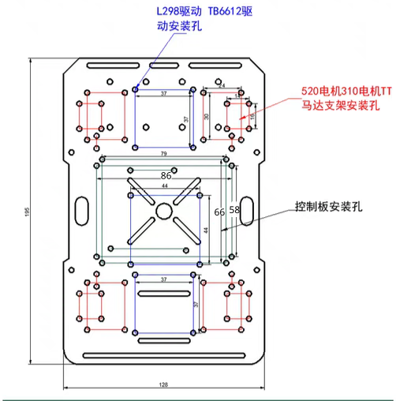

# Ros2Car

## 1 硬件环境
### 1.1 驱动板
| 封装      | 数量 |
| ----------- | ----------- |
| EPS32C3-合宙      | 1       |
| DRV8833Q   | 1        |
| HDR-TH_2P-P2.54-V-F   | 1        |
| CONN-TH_XH2.54-6P   | 2        |
| lm2596模块   | 1        |


### 1.2 上位机
    jetson nano开发板
### 1.3 电机参数
|    属性   | 参数 |
| ----------- | ----------- |
| 类型      | TT马达电机       |
| 重量   | 40g        |
| 减速比   | 1：48        |
| 工作电压   | 3-12V        |
| 编码器   | AB相增量式霍尔编码器        |
| 编码器线数   | 13线        |
| 空转   | 200RPM        |
| 额定扭矩   | 1.5kg.cm        |

### 1.4 底盘

## 2 上位机软件环境
| 软件      | 版本 |
| ----------- | ----------- |
| ubuntu      | 24.04       |
| ros2   | jazzy        |
| gazebo   | harmonic        |

## 3 仿真运行
3.1 创建桥接器转换话题
```
# 桥接cmd_vel
ros2 run ros_gz_bridge parameter_bridge /cmd_vel@geometry_msgs/msg/Twist]ignition.msgs.Twist
# 桥接camera
ros2 run ros_gz_bridge parameter_bridge /camera@sensor_msgs/msg/Image@gz.msgs.Image
```
3.2 启动teleop控制小车移动
```
ros2 run teleop_twist_keyboard teleop_twist_keyboard
```
3.3 启动Rviz2可视化运行状态
```
rviz2
```