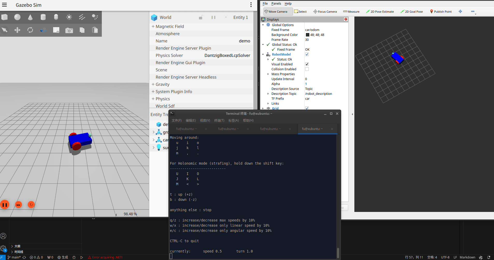
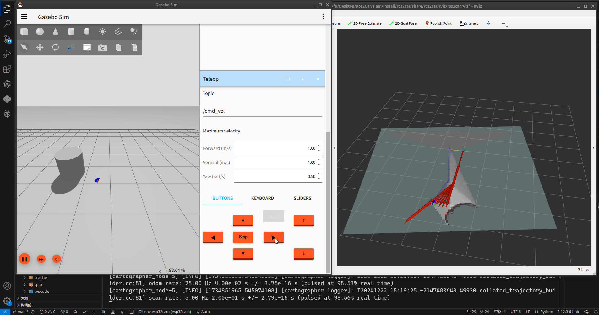
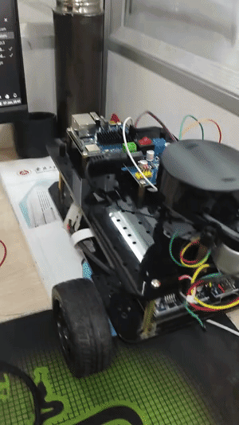
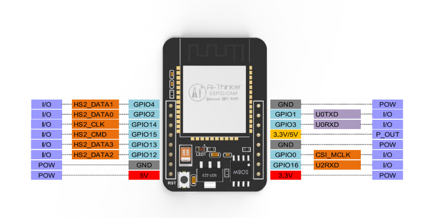
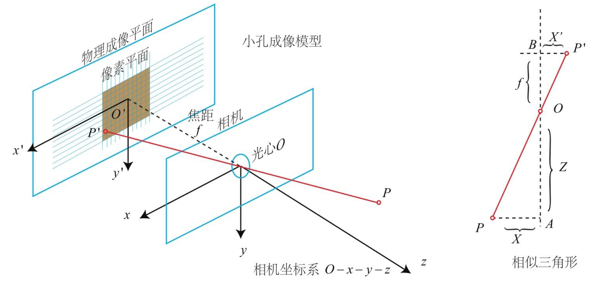

# Ros2Car

## 1 硬件环境
### 1.1 驱动板
| 封装      | 数量 |
| ----------- | ----------- |
| EPS32C3-合宙      | 1       |
| DRV8833Q   | 1        |
| HDR-TH_2P-P2.54-V-F   | 1        |
| CONN-TH_XH2.54-6P   | 2        |
| lm2596模块   | 1        |


### 1.2 上位机
    jetson nano开发板
### 1.3 电机参数
|    属性   | 参数 |
| ----------- | ----------- |
| 类型      | TT马达电机       |
| 重量   | 40g        |
| 减速比   | 1: 48        |
| 工作电压   | 3-12V        |
| 编码器   | AB相增量式霍尔编码器        |
| 编码器线数   | 13线        |
| 空转   | 200RPM        |
| 额定扭矩   | 1.5kg.cm        |

### 1.4 底盘

## 2 上位机软件环境
| 软件      | 版本 |
| ----------- | ----------- |
| ubuntu      | 24.04       |
| ros2   | jazzy        |
| gazebo   | harmonic        |

```
# 安装ros2 
wget http://fishros.com/install -O fishros && . fishros

# gazebo 配置本地模型路径, 否则会出现 "Unable to find uri[car]"
export GZ_SIM_RESOURCE_PATH=/home/fu/Desktop/Ros2Car/models
```

## 3 仿真运行
### 3.1 话题与坐标系
#### 常用命令
```
# 桥接cmd_vel
ros2 run ros_gz_bridge parameter_bridge /cmd_vel@geometry_msgs/msg/Twist]ignition.msgs.Twist
# 桥接camera
ros2 run ros_gz_bridge parameter_bridge /camera@sensor_msgs/msg/Image@gz.msgs.Image

# 启动teleop控制小车移动
ros2 run teleop_twist_keyboard teleop_twist_keyboard
# 或者话题映射到自定义话题
ros2 run teleop_twist_keyboard teleop_twist_keyboard --ros-args --remap cmd_vel:=model/car/cmd_vel

# 传感器sdf参考sensors_demo.sdf, 包含单目, 深度等相机; 如果不能显示图片刷新即可

# 自动配置桥接器和话题, 启动gazebo和rviz, 注意gazebo需要手动启动仿真
# 注意在slam文件夹下运行
colcon build
source ./install/setup.zsh
ros2 launch ros2car test.py
```
#### ros2与gazebo
```
# 机器人模型
sensor_msgs/msg/JointState[gz.msgs.Model // 关节信息
tf2_msgs/msg/TFMessage[gz.msgs.Pose_V // 位姿关系信息

# 里程计
geometry_msgs/msg/Twist@gz.msgs.Twist // 速度信息
nav_msgs/msg/Odometry@gz.msgs.Odometry // 里程计信息

#相机
sensor_msgs/msg/Image[gz.msgs.Image // 图像信息
sensor_msgs/msg/CameraInfo[gz.msgs.CameraInfo // 相机信息

# 雷达
sensor_msgs/msg/LaserScan[gz.msgs.LaserScan
sensor_msgs/msg/LaserScan[gz.msgs.PointCloudPacked 
```

#### 坐标转化
- 传感器需要设置pose字段, 默认pose不会生成transform信息, 无法给满足slam要求
- CameraInfo的frame不能直接转化到sensor, 需要设置/sensor/camera/optical_frame_id, 也可以使用<gz_frame_id>, 会发生警告但不影响使用, 也可以在gz::sim::systems::PosePublisher插件设置<publish_sensor_pose>

#### gazebo问题
- 差速小车仿真的话题和frame由四个插件组成: JointStatePublisher PosePublisher OdometryPublisher DiffDrive
- 机器人模型由robot_state_publisher包发布
- 激光雷达需要扫描到物体才会在rviz2中显示
- sdf中collsion与visual不同时, gazebo可能会出错
- 使用ADS对物体着色 ambient环境光 diffuse漫反射光 specular镜面光
- 差速插件要设置准确的轮胎半径和轮胎距离, 同时模型需要正确的转动惯量和质量, 否则移动会出现异常或小车水平位置变化, 这将导致建图出现严重误差
- 如果小车运行很慢, 很可能是世界太卡导致的
- blender建模导出到sdf

#### 运行测试程序
```
source ./install/setup.zsh
ros2 launch ros2car test.py

u-- 向左前方前进
i-- 直行前进
o-- 向右前方前进

j-- 逆时针旋转
k-- 停止
l-- 顺时针旋转

m-- 向左后方后退
,-- 后退
. - 向右后方后退

q - 增加速度
z - 减小速度
```

### 3.2 SLAM运行
#### rtabmap
```
# 安装rtabmap,支持双目, RGBD和雷达传感器
sudo apt install ros-$ROS_DISTRO-rtabmap-ros

# 运行rtabmap
source ./install/setup.zsh
ros2 launch ros2car rtabmap.py

```
#### cartographer
```
source ./install/setup.zsh
ros2 launch ros2car cartographer.py
```


问题1: passed to lookupTransform argument target_frame does not exist
解决: 设置正确的track_frame, 同时发布tf关系

问题2: passed to lookupTransform argument source_frame does not exist
解决: 设置正确的传感器数据frame, 同时发布tf关系

问题3: Check failed: data.time > std::prev(trajectory.end())->first, 出现这个问题似乎是传感器数据以相同的时间戳到达
解决: odometry_sampling_ratio 改为0.1 (暂时解决)

问题4: Trying to create a map of size,地图一直在扩大, 或地图有重影
解决: 机器人odom的话题和frame设置错误, 导致odom与slam发布的odom冲突

#### 保存地图
```
# 安装地图服务
sudo apt install ros-humble-nav2-map-server
# 保存地图命名为map
ros2 run nav2_map_server map_saver_cli -t map -f map
```
#### nav2导航
```
source ./install/setup.zsh
ros2 launch ros2car nav2.py
```

问题1 rviz2不能加载地图
原因: nav2的地图话题只会发布一次, 确保rviz2在其之前启动且已经提前订阅好话题

问题2 某插件 does not exist.
解决: 在配置文件 ros2 In Iron and older versions, "/" was used instead of "::"

问题3 某组件插件重复注册
原因: ros2 jazzy版本后bt_navigator插件自动加载, 再次添加会报错

问题4 cmd_vel收不到速度信息
原因: jazzy后需要设置cmd_vel_in_topic为cmd_vel_smoothed而不是cmd_vel_raw

注意: 要使用nav2提供的rviz配置文件, 否则功能不全
## 4 实物运行
### 4.1 串口驱动
```
# 下载ch341驱动和ch343驱动, 在driver目录下运行
http://gh.llkk.cc/https://github.com/WCHSoftGroup/ch341ser_linux

# 编译内核所需
sudo apt install kernel-headers-$(uname -r)
sudo apt install kernel-devel-$(uname -r)

make
sudo make load
sudo make install

# 查看内核缓冲
sudo dmesg

# 查看usb
lsusb

# 设置串口权限, 加入dialout用户组, username替换为你的用户名
sudo usermod -aG dialout username

# 查看用户组
cat /etc/group|grep 组名
```
### 4.2 配置platformIO
```
# 为clangd生成compile_commands.json
pio run -t compiledb
```
问题1: algorithm头文件无法找到, 原因是riscv-esp32库默认使用C编译, 不会生成C++头文件索引。但是用户代码使用C++编译, 所以clangd会识别arduino中的c++部分, 导致错误。 解决方法: 使用 Suppress: [pp_file_not_found]字段解决

问题2: xtensa-esp32-elf-g++未知三元组。 解决方法: 更新clangd服务器至19.2版本

### 4.3 手动配置micro_ros 🛠️
#### 编译micro_ros_setup
```
# 该软件包基于ROS2, 用于创建micro-ROS Agent和firmware
mkdir microros_ws
cd microros_ws
git clone -b $ROS_DISTRO https://github.com/micro-ROS/micro_ros_setup.git src/micro_ros_setup

sudo apt update && rosdep update
rosdep install --from-path src --ignore-src -y

sudo apt-get install python3-pip

colcon build
source install/local_setup.zsh
```
#### 创建micro-ROS Agent
负责PC的ROS2和MCU上的micro-ROS之间的通信。
```
# Download micro-ROS Agent packages
ros2 run micro_ros_setup create_agent_ws.sh

# Build agent and source the workspace again
ros2 run micro_ros_setup build_agent.sh
source install/local_setup.bash

# Run agent
ros2 run micro_ros_agent micro_ros_agent [parameters]
```
#### 编译MCU固件 
参考[编译静态micro-ROS库](https://micro.ros.org/docs/tutorials/advanced/create_custom_static_library/)
```
# 适用于特定平台的 micro-ROS 独立模块 
ros2 run micro_ros_setup component --help

# 创建esp32idf示例, 将创建一个固件文件夹, 其中包含构建 micro-ROS 应用程序所需的代码
ros2 run micro_ros_setup create_firmware_ws.sh freertos esp32

# 配置 micro-ROS 固件
ros2 run micro_ros_setup configure_firmware.sh [configuration] [options]

# 构建固件
ros2 run micro_ros_setup build_firmware.sh

# 刷写固件
ros2 run micro_ros_setup flash_firmware.sh

---------

# 创建自定义静态 micro-ROS 库
ros2 run micro_ros_setup create_firmware_ws.sh generate_lib

# 下载完所有包后, 需要创建几个文件, 以便交叉编译自定义静态库和一组头文件: 
touch my_custom_toolchain.cmake
touch my_custom_colcon.meta

# 配置cmake编译器路径, 以riscv为例,(path)替换为实际路径
set(CMAKE_C_COMPILER (path)/riscv32-esp-elf-gcc)
set(CMAKE_CXX_COMPILER (path)/riscv32-esp-elf-g++)
set(CMAKE_AR (path)/riscv32-esp-elf-gcc-ar)

# 编译自定义静态库,将会得到libmicroros.a
ros2 run micro_ros_setup build_firmware.sh $(pwd)/my_custom_toolchain.cmake $(pwd)/my_custom_colcon.meta
```

错误警告:💣 do not exist list index: 1 out of range (-1, 0)
```
# 错误原因是路径包含中文(史诗级巨坑),耗时两天才找到原因,很难想象2024年不支持UTF-8。仅将目录改为英文:
export LANG=en_US
xdg-user-dirs-gtk-update
export LANG=zh_CH
```

#### 堆内存问题
参考[内存配置](https://micro.ros.org/docs/concepts/benchmarking/memo_prof/):
- 对于esp32,Client 的总内存消耗高于XRCE-DDS中间件，至少使用库的默认配置参数是这样。但是，通过根据特定应用程序的需要适当地调整其中一些参数（例如，MTU 或历史大小），可以调整总内存消耗以更好地适应目标设备的有限资源。


### 4.4 自动配置micro_ros
- platformio.ini 自动配置mcu固件
```
board_microros_transport = wifi
board_microros_distro = jazzy
lib_deps = 
	https://github.com/firestrongarch/micro_ros_platformio
```
- 手动XRCE-DDS配置, 避免堆内存问题, 对于esp32系列: 修改/.pio/libdeps/esp32-c3/micro_ros_platformio/metas/colcon.meta的MAX_HISTORY和MTU
```
{
    "names": {
        "rmw_microxrcedds": {
            "cmake-args": [
                "-DRMW_UXRCE_MAX_NODES=1",
                "-DRMW_UXRCE_MAX_PUBLISHERS=10",
                "-DRMW_UXRCE_MAX_SUBSCRIPTIONS=5",
                "-DRMW_UXRCE_MAX_SERVICES=1",
                "-DRMW_UXRCE_MAX_CLIENTS=1",
                "-DRMW_UXRCE_MAX_HISTORY=2",
                "-DRMW_UXRCE_TRANSPORT=custom"
            ]
        },
        "microxrcedds_client":{
            "cmake-args":[
                "-DUCLIENT_CUSTOM_TRANSPORT_MTU=1024"
            ]
        }
    }
}
```
- docker运行Agent
```
# UDPv4 micro-ROS Agent
docker run -it --rm -v /dev:/dev -v /dev/shm:/dev/shm --privileged --net=host microros/micro-ros-agent:$ROS_DISTRO udp4 --port 8888 -v6

# Serial micro-ROS Agent
docker run -it --rm -v /dev:/dev -v /dev/shm:/dev/shm --privileged --net=host microros/micro-ros-agent:$ROS_DISTRO serial --dev [YOUR BOARD PORT] -v6

# TCPv4 micro-ROS Agent
docker run -it --rm -v /dev:/dev -v /dev/shm:/dev/shm --privileged --net=host microros/micro-ros-agent:$ROS_DISTRO tcp4 --port 8888 -v6

# CAN-FD micro-ROS Agent
docker run -it --rm -v /dev:/dev -v /dev/shm:/dev/shm --privileged --net=host microros/micro-ros-agent:$ROS_DISTRO canfd --dev [YOUR CAN INTERFACE] -v6

```

### 4.5 开发esp32c3
1. 串口通信
💡确定串口名称/dev/ttyACM0
```
// 初始化串口
Serial.begin(115200);
Serial.println(val)
```
2. pwm输出, 使用analogwrite的方式实现
```
analogWrite(pin, dutycycle)：在指定的引脚上启用软件PWM。占空比在0到PWMRANGE之间，默认为1023。

analogWrite(pin, 0)：禁用指定引脚上的PWM。

analogWriteResolution(new_range)：该功能用于改变PWM分辨率。

analogWriteFrequency(new_frequency)：调用此功能可将其更改为新频率.PWM频率范围为1 - 1000hz。
```


### 4.6 开发esp32CAM
使用OV2640用于采集单目RGB图像, 目前暂时用不到, 后续可能使用其他相机
#### 引脚定义 👣


⚠ ESP32-CAM 上的 IO0 和 GND 短接以进入下载模式（拔掉才可以运行程序！）。烧录时可能需要先复位或重新连接电脑。
GPIO1 和 GPIO3分别为uart0的rx和tx

❌ LoadProhibited, StoreProhibited 当应用程序尝试读取或写入无效的内存位置时，会发生此类 CPU 异常。

#### 相机矫正 🤔
相机需要矫正内参矩阵和畸变矩阵, 内参矩阵的 $f_x$ 和 $f_y$ 由相机焦距和光电二极管尺寸决定, 偏移量 $c_x$ 和 $c_y$ 由相机光心的位置决定(因为像素坐标系原点在左上角, 相机坐标系在光心位置)

#### 图像处理ISP 🧩
此部分由ESP32CAM完成, 主要将RAW图像转化为可以用于SLAM的图像

### 4.7 香橙派
香橙派orangepi-zero3-1.5G, 目前仅用于数据传输, 数据交给PC处理
#### 雷达驱动 🧑‍🦽
```
# 安装HLDS HLS-LFCD-LDS (LDS-01)雷达驱动
sudo apt install ros-jazzy-hls-lfcd-lds-driver

# 安装EAI-X2驱动
git clone http://gh.llkk.cc/https://github.com/fishros/ydlidar_ros2 -b  fishbot

cd ydlidar_ros2
colcon build

# 注意香橙派串口连接到26pin的10号引脚uart5(RX)或者连接uart0(串口调试引脚)
sudo chmod 666 /dev/ttyS5
source install/setup.zsh
ros2 launch ydlidar ydlidar_launch.py

# 💡Linux系统中 uart5 默认是关闭的，需要手动打开才能使用。
sudo orangepi-config
然后选择 System->Hardware->ph-uart5(空格选中)->Save->Back->Reboot

# 上述步骤完成后, 此时可在上位机中查看雷达话题
ros2 topic list

# 也可以直接在rviz2中显示
rviz2
```
问题1: qos不兼容导致rviz2显示不出雷达
解决: 在雷达话题显示菜单中, 选择Reliability Policy为Best Effort

# MarkDown本地渲染配置
```
# 安装katex
sudo apt install katex

# 安装mathtex
sudo apt install node-mathjax-full

# 安装pandoc, 用于导出pdf
sudo apt install pandox
sudo apt install texlive-full

sudo apt-get install librsvg2-bin # export svg
sudo apt-get install texlive-latex-base # pdflatex
sudo apt-get install texlive-latex-extra # color
```